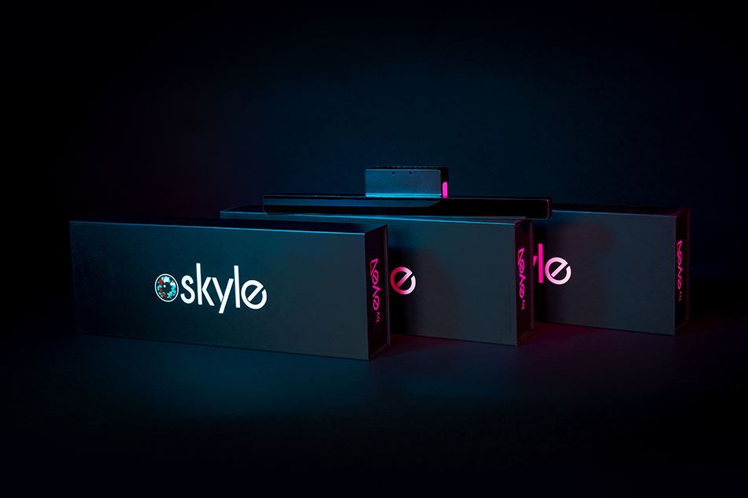
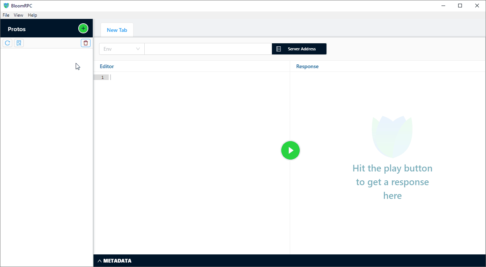

# Skyle.proto

Description and documentation of the Skyle gRPC interface, written in Protocol Buffers Version 3.
Using this protocol, you can communicate with a Skyle eye tracker. Skyle is an eye tracking device made and sold by [eyeV GmbH](https://eyev.de/).

#### Supported devices
| Skyle (first generation) | Skyle (second generation) |
| ---------- | ---- |
|  |  |

## Connection

You can connect to the gRPC service with the published proto file on **skyle.local:50052**. 
If you use our Skyle Integration Kit (SIK) connect to port 50051 (**skyle.local:50051**).

## Usage example

**Important: Update to the latest firmware (>= v3.0) on your eye tracker before using this!**

If you want to try this with your eye tracker without writing code, it is recommended to use the Skyle.proto file with [BloomRPC](https://github.com/uw-labs/bloomrpc).
It is an open-source GUI Client for gRPC services, that instantly works with the provided proto file:

_For detailed usage, please refer to the [Wiki](https://github.com/eyev-de/Skyle.proto/wiki)._

## Documentation

Please see the full [documentation here](Documentation.md).

## Meta

(c) 2020 - 2022 eyeV GmbH, written by Mathias Anhalt

Distributed under the MIT license. See ``LICENSE`` for more information.

[Also see our other repos here](https://github.com/eyev-de)

## Support

If you bought the Skyle eye tracker and need support, please contact support@eyev.de.